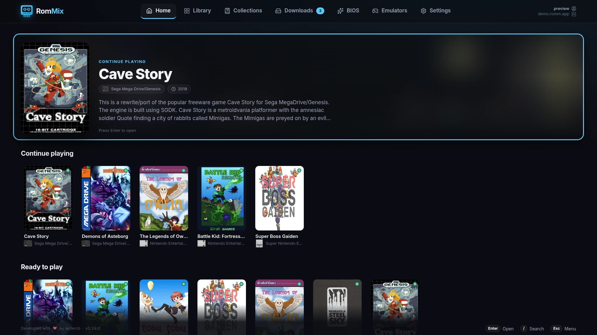
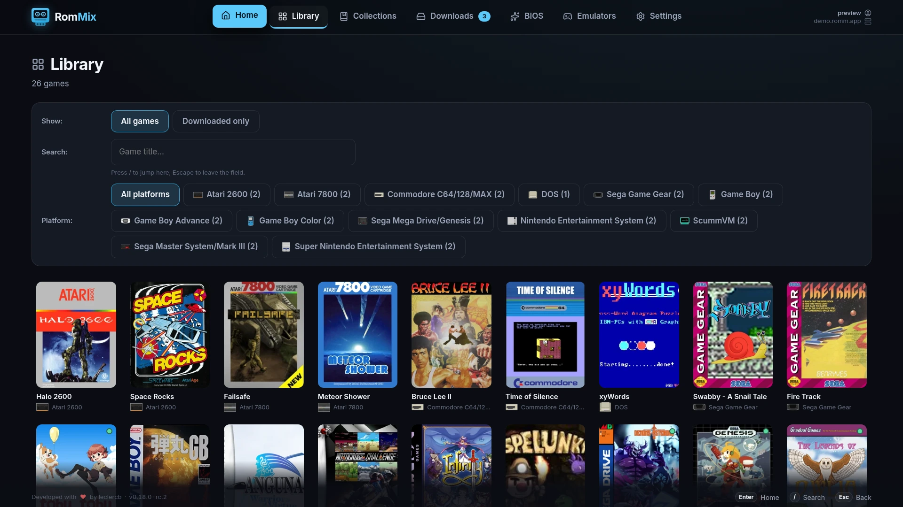
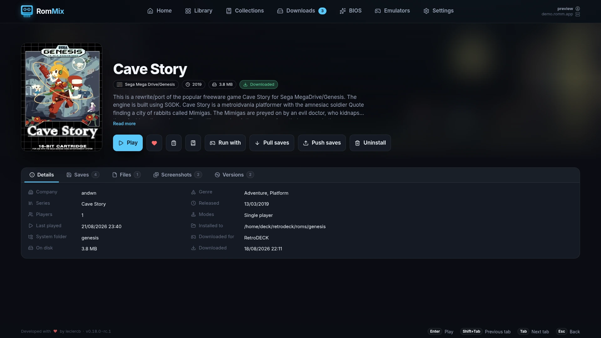
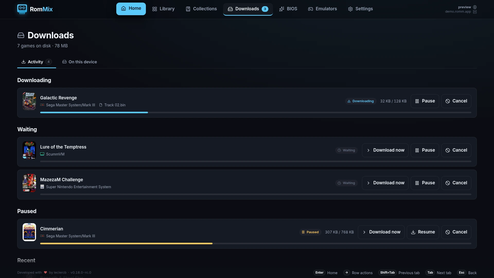
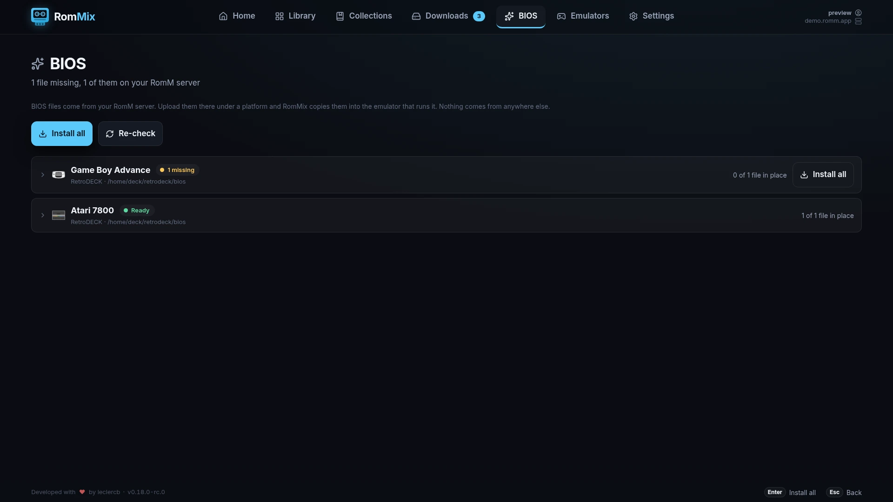
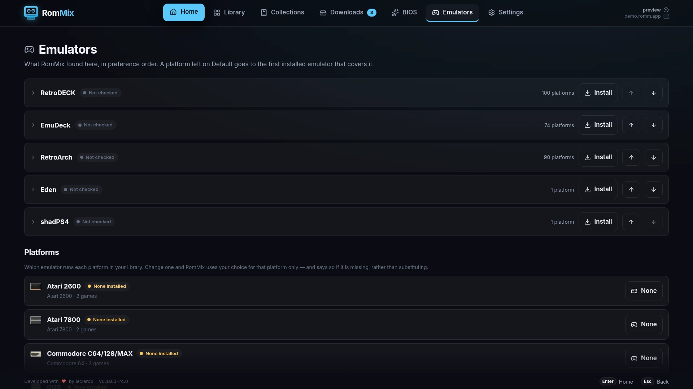
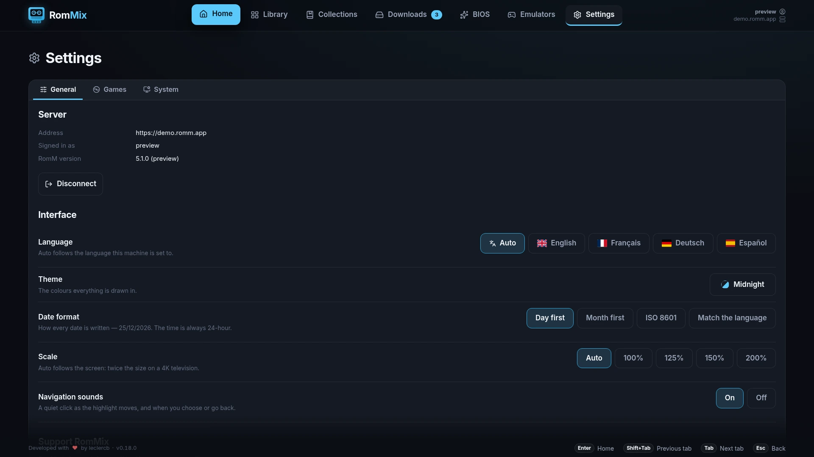

<div align="center">


# RomMix

**A Big Picture–style front end for your own [RomM](https://romm.app) server.**

[](https://github.com/leclercb/rommix/actions/workflows/release.yml)
[](https://github.com/leclercb/rommix/releases/latest)
[](https://github.com/leclercb/rommix/releases)
[](#-install)
[](LICENSE)

</div>

Browse your library like a console dashboard, download a game into your
emulator's ROM folder, play it, and your saves go back to RomM when you quit.

Website: https://leclercb.github.io/rommix/

Demo: https://leclercb.github.io/rommix/demo/

<div align="center">



</div>

---

## Contents

[Features](#-features) · [Screenshots](#-screenshots) ·
[Requirements](#-requirements) · [Install](#-install) ·
[Signing in](#-signing-in) · [Controls](#-controls) · [Using it](#-using-it) ·
[Emulators](#-emulators) · [Settings](#-settings) ·
[Where your files go](#-where-your-files-go) ·
[Troubleshooting](#-troubleshooting) · [Development](#-development) ·
[Contributing](#-contributing) · [Support](#-support) · [Licence](#-licence)

---

## ✨ Features

- 🗄️ Browse your whole RomM library, searchable and filtered by platform
- 🏠 Shelves for what you played last, what is on this device and your favourites
- 📚 Your RomM collections, and the ones RomM builds itself
- ⬇️ Downloads into your emulator's own ROM folder, or one folder you point them all at
- 📋 Downloads you can pause and resume, each one checked against RomM's hash
- 💿 Multi-disc sets unpacked and launched as one game
- ☁️ Saves and states synced both ways, plus a per-game tab to do it by hand
- ❤️ Favourites, progress and play time saved to RomM
- ✈️ Offline mode — play your downloaded games with no connection: covers,
  details, screenshots and Play all still work
- 🔁 Downloads and unsent saves resume when you are back online
- 🧩 BIOS files installed from your own server
- 🎛️ Emulators installed and assigned by RomMix, changeable per platform
- 📱 Sign in by scanning a code with your phone
- 🎮 Controller-driven and fullscreen, desk to television
- 🩺 A pre-flight check that names what is wrong before a launch fails
- 🌍 English, French, German and Spanish
- 🔄 It updates itself

---

## 📸 Screenshots

|                                                                      |                                                                   |
| -------------------------------------------------------------------- | ----------------------------------------------------------------- |
| <br>**Library**       | <br>**A game**         |
| <br>**Downloads** | <br>**BIOS**             |
| <br>**Emulators** | <br>**Settings** |

---

## 📦 Requirements

- **Linux**, x86_64 or arm64. Plus `flatpak` for the emulators packaged that
  way; RomMix adds the Flathub remote itself.
- **A RomM server** you can reach, version 5.x or newer, with an account.
- **A controller**, recommended but not required.
- **At least one emulator**, from the five RomMix drives:

  | Emulator      | Covers                                    | Installed by RomMix                           |
  | ------------- | ----------------------------------------- | --------------------------------------------- |
  | **RetroDECK** | 79 systems, the NES to the PS3            | ✅ Flatpak                                    |
  | **EmuDeck**   | 74 systems, the NES to the Switch and 360 | ❌ Its own installer, see [EmuDeck](#emudeck) |
  | **RetroArch** | 69 systems, one libretro core each        | ✅ Flatpak                                    |
  | **Eden**      | Nintendo Switch                           | ✅ AppImage                                   |
  | **shadPS4**   | PlayStation 4                             | ✅ Flatpak and AppImage                       |

  **Emulators** → **Platforms** shows what every system resolves to. Start with
  RetroDECK if you have none — it covers the most platforms.

---

## 📥 Install

Download the AppImage from
[Releases](https://github.com/leclercb/rommix/releases) and choose `x86_64` or
`arm64` depending on your machine's architecture.

```bash
chmod +x RomMix-x86_64.AppImage
./RomMix-x86_64.AppImage                    # desktop
gamescope -f -- ./RomMix-x86_64.AppImage    # gamescope session
```

No version in the file name: updates are written over that same file.

### From Steam

Download `rommix-steam.sh` from the same release, keep it **beside** the
AppImage, and add the _script_ as the non-Steam game — Steam cannot launch an
AppImage directly.

```bash
chmod +x RomMix-x86_64.AppImage rommix-steam.sh
```

### Build it yourself

Node 24 or newer.

```bash
git clone https://github.com/leclercb/rommix.git
cd rommix
npm install
npm run appimage        # writes dist/RomMix-<arch>.AppImage
```

That builds for the machine you are on; `npm run package -- --arm64` targets the
other one.

---

## 🔑 Signing in

On first launch RomMix asks for your server address and one of:

1. **Pair this device** _(best on a TV)_ — a code and a QR to approve in RomM.
2. **API token** — an `rmm_…` token from RomM's _Administration → Client tokens_.
3. **Username and password**.

Credentials live in `~/rommix`, encrypted with the system keyring, or in a file
readable only by you where no keyring is reachable.

---

## 🎮 Controls

| Action              | Controller         | Keyboard         |
| ------------------- | ------------------ | ---------------- |
| Navigate            | Left stick / D-pad | Arrow keys       |
| Select              | A                  | Enter or Space   |
| Back                | B                  | Esc or Backspace |
| Settings            | X or Start         | M                |
| Search              | Y                  | /                |
| Previous / next tab | LB / RB            | Shift-Tab / Tab  |
| Back from a game    | Start, held        | —                |

---

## 🧭 Using it

- **Home** — the game you last played, what is on this device, your favourites
  and recent additions.
- **Library** — everything on your server. A dot on a cover means it is
  downloaded.
- **Collections** — the collections you made on RomM, and the virtual ones RomM
  builds itself.
- **Downloads** — the queue, and everything on this device by platform. **Sync
  with disk** forgets games you deleted by hand and adopts ROMs you copied in.
- **BIOS** — per platform, then copies the missing files into place. They come
  from your own server only: upload them to RomM under a platform. Switch, PS3,
  Vita, 3DS and Wii U need a dump from a real console instead, and say so.
- **Emulators** — what is installed, and which one runs each platform (below).
- **A game's page** — download, play, uninstall, favourite it, say how far
  through it you are, put it in a collection, and four tabs: **Details**,
  **Saves**, **Files**, **Screenshots**.
  Where an emulator offers more than one way to run a platform, RomMix asks once
  and remembers; **Run with…** changes the answer.

When your server cannot be reached, the same screens narrow rather than
disappearing: Home keeps **Ready to play**, the Library shows what is
downloaded, BIOS still says what each console needs and what is in place, and a
game keeps its cover, its details, its screenshots and its Play button. Only
Collections goes, having no local half. Everything returns on its own once RomM
answers again: the transfers the network stopped carry on, and any save that
could not be sent is sent.

---

## 🔌 Emulators

**The list.** Buttons install an emulator, or **Run** one on its own — needed
for the setup only the emulator can do: RetroDECK creates its folders on first
run, RetroArch needs its cores, Eden its keys, shadPS4 to be told where the
games are.

The order is the preference: a platform you have not chosen for goes to the
first emulator in the list that is installed and covers it, so **Move up** makes
one the default for everything it can run.

**Platforms.** One row per platform, showing which emulator runs it; press to
cycle. Each emulator keeps games in its own folder, so pointing a platform
elsewhere means RomMix offers those games for download again. Nothing is
deleted, and pointing it back brings them straight back.

### EmuDeck

Install [EmuDeck](https://www.emudeck.com) with its own installer and finish its
setup; RomMix then finds it and needs no configuration. It reads your
`Emulation` folder from EmuDeck's settings, so a library on an SD card is found
without being told, and it launches games through `Emulation/tools/launchers/` —
EmuDeck's own configuration, cloud saves included, is what runs the game.

Where EmuDeck installed several emulators for one system, RomMix asks which to
use the first time you play something on that platform.

---

## 🔧 Settings

**General → Interface.** Language, and **Scale**: the interface is laid out for a
1080p television, so **Auto** doubles it on a 4K one. Pick a number if your panel
is nearer or further away.

**Games → Games on disk.** Downloads go to each emulator's own ROM folder, or to
one RomMix folder you point every emulator at.

**Games → Save sync.**

- **Download newer saves before playing** — only ever replaces an _older_ local
  save, keeping the last few copies of it under `saves/` in the RomMix folder
  first.
- **Upload saves after playing** — sends only what the session wrote.
- **Ask before sending saves to RomM** — on by default. Lists the files and
  sends only what you approve.

Saves named after the ROM sync cleanly, and Switch-family saves are matched by
title id. Emulators that share one memory card between every game cannot be
synced, and RomMix says so rather than uploading the wrong data.

**Games → Downloads → Ask before deleting a downloaded game**, on by default.

**System → Pre-flight check.** Whether `flatpak` and Flathub are there, whether
each emulator has been run, whether the ROM folder is writable — named, rather
than left to fail at launch.

**System → RomMix folder.** Settings, credentials, the download index and any
emulator RomMix installed live in `~/rommix`. Set a new path and RomMix copies
it across and restarts; ROMs and emulators stay where they are. `ROMMIX_HOME`
overrides it.

**System → Updates.** Nothing updates an AppImage for you, so RomMix checks its
own [releases](https://github.com/leclercb/rommix/releases) shortly after
starting, then every few hours.

- **Automatic**, the default — downloaded in the background, used at the next
  start. Nothing restarts on its own; **Restart now** is there if you want it.
- **Tell me** — notification and a version badge on Settings; nothing is
  downloaded until you press **Download**.
- **Off** — never checks by itself. **Check now** still does.

**Release candidates**, off by default, is a separate switch: on, RomMix also
offers versions published for testing — tagged `0.9.0-rc.1` and marked as
pre-releases — which arrive before a finished release and have had less use.

Two cases RomMix cannot finish on its own, both of which it says on screen:
**started from Steam**, where Steam forbids a program restarting itself — quit
and press Play again; and an image it **cannot write to**, where the releases
page is the way to get the new version.

### Settings that are not on screen

Two rare options live in `~/rommix/config/settings.json`. Close RomMix before
editing it.

```json
{
  "settings": {
    "systemOverrides": { "sega-pico": "segapico" },
    "emulatorPaths": { "eden": "/mnt/games/Eden.AppImage" }
  }
}
```

`systemOverrides` maps a RomM platform slug to an ES-DE system folder, for a
platform RomMix has none for. `emulatorPaths` points at an emulator kept
somewhere RomMix would not look.

---

## 📁 Where your files go

| What                                  | Where                                                  |
| ------------------------------------- | ------------------------------------------------------ |
| ROMs                                  | The emulator's `<roms>/<system>/`, or `~/rommix/roms/` |
| Saves and states                      | The emulator's own save folders                        |
| BIOS files                            | The emulator's own BIOS folder                         |
| Settings, credentials, download index | `~/rommix/config/`                                     |
| What RomM says about installed games  | `~/rommix/offline/`                                    |
| Emulators RomMix installed            | `~/rommix/emulators/`                                  |
| Log file                              | `~/rommix/logs/rommix.log`                             |

By default ROMs go into each emulator's own library, so a game is still there
when you start that emulator yourself. Settings → Games → **Games on disk**
switches that to one RomMix folder instead.

---

## 🩺 Troubleshooting

Settings → System → **Pre-flight check** names the common problems, and **Re-run
check** re-tests after you fix one.

**RomMix does not start, or the Steam shortcut does nothing.** Run it from a
terminal — an AppImage that cannot start says why there and nowhere else. If it
starts from a terminal but not from Steam, look in
`~/.local/share/Steam/logs/console-linux.txt`.

**`Cannot mount AppImage`, `mount failed: Operation not permitted`, or `No
suitable fusermount binary found`.** Steam launches games in a way that stops an
AppImage mounting itself; no `PATH` or `FUSERMOUNT_PROG` value changes that. Use
`rommix-steam.sh` from the release — see [From Steam](#from-steam).

**`error while loading shared libraries: libnspr4.so`** (or `libglib-2.0.so.0`).
The distribution does not ship the libraries an unpatched binary expects. On
NixOS it needs answering twice, since Steam runs games in its own FHS
environment where `programs.nix-ld` does not apply:

```nix
# Appended, because assigning this option replaces nixpkgs' own default set.
programs.nix-ld.enable = true;
programs.nix-ld.libraries =
  options.programs.nix-ld.libraries.default ++ electronLibraries;

# For running it from Steam.
programs.steam.extraPackages = electronLibraries;
```

where `electronLibraries` is, with `pkgs`:

```nix
[
  alsa-lib at-spi2-core cairo cups dbus expat fontconfig freetype glib gtk3
  libdrm libgbm libglvnd libx11 libxcb libxcomposite libxcursor libxdamage
  libxext libxfixes libxi libxkbcommon libxrandr libxrender libxshmfence
  libxtst nspr nss pango
]
```

Also on NixOS: leave `programs.appimage.binfmt` off, and an AppImage emulator
needs `programs.nix-ld.enable` too.

**"flatpak is not installed".** Most of the emulators are flatpaks, so without
the command none can be found or installed.

**"Flathub is not set up for your user".** RomMix adds the remote the first time
you install an emulator; by hand:

```bash
flatpak remote-add --user --if-not-exists flathub https://dl.flathub.org/repo/flathub.flatpakrepo
```

**"… has not been run yet, so its folders do not exist".** Press **Run** beside
it on the **Emulators** page, let it start, then re-run the check.

**"The ROM folder is not writable".** Check its permissions, and that the drive
it is on is mounted.

**"No installed emulator can run …".** Nothing installed covers that platform —
Emulators → Platforms shows what each resolves to.

**"RomMix does not know which folder … maps to".** Add a `systemOverrides` entry.

**A game shows as not downloaded although the file is there.** Its platform is
pointed at a different emulator now, and the file is in the previous one's
library. Point it back, or download a copy for the new one.

**The game starts but RomMix keeps focus, and Steam does not list its window.**
Something is launching the emulator outside the tree Steam started. Add the
AppImage to Steam directly, or a script that `exec`s it.

**The controller does nothing.** Press a button on it and check the pre-flight
check: Chromium hides pads until one is used. A pad listed as `(unmapped)` is
one Chromium does not recognise; the buttons RomMix uses still work, and any
that do not are worth reporting with that name.

**The interface is tiny on a 4K television.** Settings → General → Interface →
**Scale**; set 200% by hand if Auto did not.

### The log

`~/rommix/logs/rommix.log` holds everything RomMix does — the command each
emulator was started with, what was asked of RomM, where every file was written.
Credentials are stripped on the way in, so it is safe to paste into a bug report.

```bash
tail -f ~/rommix/logs/rommix.log
```

A new file each day, or sooner if one gets large; the old ones sit beside it
under the date they cover and are deleted after a fortnight. `ROMMIX_LOG=debug`
adds every request and probe; `ROMMIX_LOG=off` writes nothing.

---

## 🧰 Development

```bash
npm install
npx install-electron   # Electron no longer fetches its binary on install
npm run dev            # against a live RomM server
npm run preview:app    # the front end alone, in a browser, on :5273
npm run preview:web    # the whole public site, built and served, on :5274
npm run format:check   # npm run format fixes what it complains about
npm run lint
npm run typecheck
npm test
npm run test:coverage  # the same suite, against the floor in package.json
npm run appimage       # build dist/RomMix-<arch>.AppImage
```

Those four checks are what CI runs, in that order, and what `npm run release`
refuses to cut a tag without. `npm install` installs a pre-commit hook that runs
them too, plus `npm run build`. [CONTRIBUTING.md](CONTRIBUTING.md) covers the
layout, the house style and how to add an emulator — which, like adding a system
or a BIOS requirement, is a change in `src/config/` and nowhere else.

### The web preview and the site

`npm run preview:app` runs the renderer as a web page against a stub library.
`npm run build:site` assembles it with the landing page into `out/site` — what
[Pages](.github/workflows/pages.yml) publishes. The landing page is a template,
[site/index.html](site/index.html), rendered once per language from
[site/text/](site/text) by [scripts/build-landing.mjs](scripts/build-landing.mjs):
English at the root, French, German and Spanish in folders beside it.

`npm run screenshots` builds that demo and photographs it, writing the pictures
in [site/img/](site/img) — the ones the landing page and this README use. Run it
after a change to a screen.

### Releasing

```bash
npm run release minor          # or major, patch, or an exact version
npm run release:rc -- minor    # 0.9.0-rc.0, and again for rc.1
npm run release -- --dry-run   # npm eats flags that come without the --
```

[release-it](https://github.com/release-it/release-it) runs the checks, bumps the
version, writes the [CHANGELOG.md](CHANGELOG.md) entry, commits, tags and pushes;
a `v*` tag publishes a release with the AppImage attached. The entry falls back to
commit subjects, each followed by its commit id, so write the `## <version>`
section by hand first if you want prose — it is what the release page says under
**What's new**.

A version with a suffix publishes as a pre-release, which is what keeps it out of
the release GitHub calls latest: only installations that turned **Release
candidates** on are offered it, and `npm run release minor` afterwards is the
finished version everyone else gets. That one takes its candidates over: their
sections are folded into its own and removed, so the changelog lists each change
once and the release page tells somebody upgrading from the last finished
version everything that has happened since.

---

## 🤝 Contributing

[CONTRIBUTING.md](CONTRIBUTING.md) — how to get set up, what CI checks, and where
each kind of change belongs.

Security reports go through
[private vulnerability reporting](https://github.com/leclercb/rommix/security/advisories/new)
rather than a public issue — see [SECURITY.md](SECURITY.md).

---

## ☕ Support

<a href="https://buymeacoffee.com/leclercb"></a>

---

## 📄 Licence

MIT — see [LICENSE](LICENSE).
